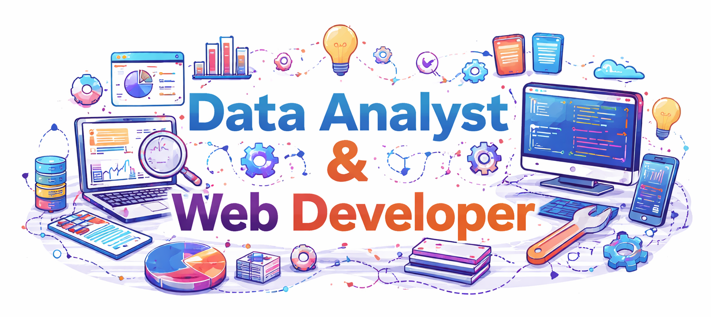

<h1 align="center">Hi 👋, I'm Sahaj</h1>

Hey there! I'm a curious mind who loves exploring data and discovering the stories hidden within it.  
I enjoy building things, learning from mistakes, and improving through real-world projects.

- 💬 Ask me about **Data Science, Python, and Frontend Development**
- 📫 Reach me at **sahaj2804@gmail.com**
- ⚡ Fun fact: **I enjoy wrestling with messy datasets until they finally make sense**

---

<h3 align="left">Connect with me:</h3>

---

<h3 align="left">Languages & Tools:</h3>

